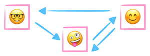
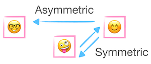
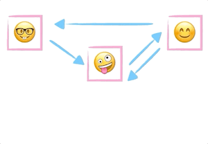

# JavaScript Graph Data Structure

**[📹 Video](https://egghead.io/lessons/javascript-javascript-graph-data-structure)**

💻[Github repo](https://github.com/kyleshevlin/intro-to-data-structures-and-algorithms/blob/master/graphs/index.js)

## Summary



A Graph is a collection of nodes (vertices) that can point to other nodes via edges. There is no hierarchy (top, bottom, start, end) in a graph, so other nodes are referred to as neighbors. Each node or vertex has a collection of neighbors.

## Use case

Graphs are great for representing relationships between data. They're used by a lot of core functionality of widely used programs:

- GraphQL
- Car navigation or Google Maps (path optimization)
- Recommendation engines

## Analogy

Twitter follows are a good way to think about graphs. When you follow someone on Twitter that is a one way connection (edge). They may choose to follow you back, but that is a separate connection (edge)

## Node

A node is an item in the graph. It is also known as a vertex and may be connected to other vertices via edges (lines connecting vertices).

Each node has a collection of neighbors - usually represented by an array. When a new node is inserted into a graph it is connected via edges with the other nodes.

## Graph

A graph is a collection of nodes and edges. In a directed graph (what we build in this video) both nodes must point to each other in order to have symmetric edges. In other words, you can have a node with a one-way relationship to another node - one node contains the other node in its neighbors but it does not appear in the other nodes neighbors.



A graph is not hierarchical - it has no order, rank, start or end. It is just a collection of nodes and edges.

## addNode



The `addNode()` method takes a key (identifier for the node), creates a node data structure and adds it to the graph's nodes. We can use the `Array.push()` method to insert it into the graph's array of nodes.

## getNode


The `getNode()` method allows us to find a node based on its key. We can use the `Array.find()` method to locate it in the graph's array of nodes.

## addEdge


The `addEdge()` method creates a relationship or edge between two nodes. In an undirected graph, we add the relationship both ways to keep our edges symmetrical. In a directed graph, we would need to call the `addEdge()` method for each direction, if we wanted the edges to be symmetrical.

## Implementation

```js
function createNode(key) {
  const neighbors = []

  return {
    key,
    neighbors,
    addNeighbor(node) {
      neighbors.push(node)
    }
  }
}

function createGraph(directed = false) {
  const nodes = []
  const edges = []

  return {
    directed,
    nodes,
    edges,

    addNode(key) {
      nodes.push(createNode(key))
    },

    getNode(key) {
      return nodes.find(node => node.key === key)
    },

    addEdge(node1Key, node2Key) {
      const node1 = this.getNode(node1Key)
      const node2 = this.getNode(node2Key)

      node1.addNeighbor(node2)
      edges.push(`${node1Key}-${node2Key}`)

      if (!directed) {
        node2.addNeighbor(node1)
      }
    }
  }
}
```

---

📹 [Go to Previous Lesson](https://egghead.io/lessons/javascript-linked-list-data-structure-in-javascript)
📹 [Go to Next Lesson](https://egghead.io/lessons/javascript-breadth-first-javascript-search-algorithm-for-graphs)
