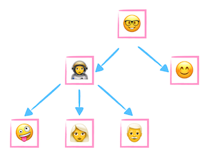
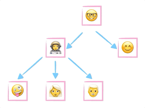

# Tree Data Structure in JavaScript

**[📹 Video](https://egghead.io/lessons/javascript-tree-data-structure-in-javascript)**

💻[Github repo](https://github.com/kyleshevlin/intro-to-data-structures-and-algorithms/blob/master/trees/index.js)

## Summary



A tree is a special type of graph - a collection of nodes and their relationships to other nodes. **However, what makes a tree special is that it is hierarchical (in rank or order), and rather than neighbors, nodes have children.**

A tree starts at the root node - top most node - and stems out from there - similar to a christmas tree 🎄

## Use case

- DOM (Document Object Model)
- Directory or folder structure
- Binary search tree - fast to traverse and find nodes

## Traversal



There are multiple traversal algorithms we can use to visit each node. In this video we implement a depth first traversal algorithm - as it starts at the top and recursively visits each node's first child until it reaches a leaf node of the tree, then it goes up one layer and continues down from the next child.

## Implementation

**trees/index.js**

Tree:

```js
function createNode(key) {
  const children = []

  return {
    key,
    children,
    addChild(childKey) {
      const childNode = createNode(childKey)
      children.push(childNode)
      return childNode
    }
  }
}

function createTree(rootKey) {
  const root = createNode(rootKey)

  return {
    root
  }
}
```

Traversal function:

```js
function traverse(node, visitFn, depth) {
  visitFn(node, depth)

  if (node.children.length) {
    node.children.forEach(child => {
      traverse(child, visitFn, depth + 1)
    })
  }
}
```

---

📹 [Go to Previous Lesson](https://egghead.io/lessons/javascript-write-a-depth-first-search-algorithm-for-graphs-in-javascript)
📹 [Go to Next Lesson](https://egghead.io/lessons/javascript-build-a-binary-tree-in-javascript-and-several-traversal-algorithms)
