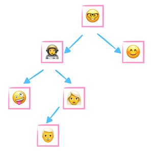
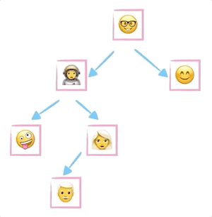

# Build a Binary Tree in JavaScript and Several Traversal Algorithms

**[📹 Video](https://egghead.io/lessons/javascript-build-a-binary-tree-in-javascript-and-several-traversal-algorithms)**

💻[Github repo](https://github.com/kyleshevlin/intro-to-data-structures-and-algorithms/blob/master/binaryTrees/index.js)

## Summary



A binary tree is a special type of tree where each node can only have up to two children - left and right. A sorted binary tree - also known as a binary search tree - contains lower value nodes on the left and higher value nodes on the right. This makes searching for a node extremely efficient, as 50% of the possible options are eliminated in each iteration.

🤔[Binary search tree](https://en.wikipedia.org/wiki/Binary_search_tree)

## Use case

- Binary search tree: an efficient searching algorithm for sorted nodes in a binary tree.

- Binary space partition: used by 3D game engines to determine what is in the viewport and needs to be rendered.

## Traversals

**In order**


Starting from the root node, it traverses down the left side of the tree until it finds a leaf node and calls the visit function. Then it will visit that node's parent and call the visit function. Then it will traverse from that node's right and try to traverse the left side until it reaches a leaf node and call the visit function, and so on.

**Pre order**



Starting from the root node, it calls the visit function, then traverses the left side of the tree calling the visit function on each node. Once it reaches a leaf node it will move up to the parent and traverse to the right node, call the visit function and continue traversing the left most branch, until it reaches a leaf node.

**Post order**


Starting from the root node, it traverses down the left side of the tree until it finds a leaf node, calls the visit function, jumps to it's sibling, calls the visit function, moves to their parent, calls the visit function, and so on. The last node it calls the visit function on is the root.

## Implementation

```js
function createBinaryNode(key) {
  return {
    key,
    left: null,
    right: null,
    addLeft(leftKey) {
      const newLeft = createBinaryNode(leftKey)
      this.left = newLeft
      return newLeft
    },
    addRight(rightKey) {
      const newRight = createBinaryNode(rightKey)
      this.right = newRight
      return newRight
    }
  }
}

const TRAVERSALS = {
  IN_ORDER: (node, visitfn) => {
    if (node !== null) {
      TRAVERSALS.IN_ORDER(node.left, visitFn)
      visitFn(node)
      TRAVERSALS_IN_ORDER(node.right, visitFn)
    }
  },
  PRE_ORDER: (node, visitfn) => {
    if (node !== null) {
      visitFn(node)
      TRAVERSALS.PRE_ORDER(node.left, visitFn)
      TRAVERSALS_PRE_ORDER(node.right, visitFn)
    }
  },
  POST_ORDER: (node, visitfn) => {
    if (node !== null) {
      TRAVERSALS.POST_ORDER(node.left, visitFn)
      TRAVERSALS_POST_ORDER(node.right, visitFn)
      visitFn(node)
    }
  },
}

function createBinaryTree(rootKey) {
  const root = createBinaryNode(rootKey)

  return {
    root
  }
}
```

---

📹 [Go to Previous Lesson](https://egghead.io/lessons/javascript-tree-data-structure-in-javascript)
📹 [Go to Next Lesson](https://egghead.io/lessons/javascript-sort-an-array-with-a-javascript-do-while-loop-using-bubble-sort)
