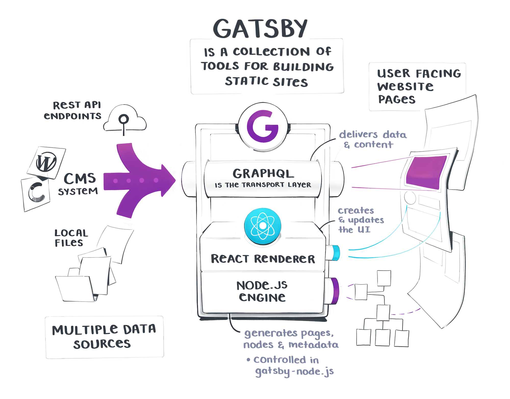

# Setup The Simplest Gatsby Project

[📹 Video link](https://www.egghead.io/lessons/gatsby-setup-the-simplest-gatsby-project)

[💻 Course Repository - 01 Simple Gatsby Project](https://github.com/Khaledgarbaya/moving-from-cra-to-gatsby-course/releases/tag/01-simple-gatsby-project)

## Notes

Inside of an empty directory, run `npm init -y` to initialize a new empty folder.

Next, we'll add some dependencies:

```
npm i gatsby react react-dom
```

Now inside of the `package.json` file, replace the `test` script with a `develop` script:

```
scripts: {
  develop: "gatsby develop"
}
```

Save the `package.json` file, and go back to the terminal.

Run `npm run develop`.

When you visit `http://localhost:8000` you will see a Gatsby.js development 404 page.

The error message tells us that we have to create a React.js component at `src/pages/index.js`, so let's do that.

### Inside of our project directory, we need to create:

- An `src/` directory.
- A `pages/` subdirectory inside of `src/`
- An `index.js` file inside of pages

Inside of `src/pages/index.js` we need to import React at the top of the file. At the bottom of the file, we'll export a simple component:

```
import React from 'react'

export default () => <h1>Hello World</h1>
```

Now our localhost:8000 page will refresh, and we will see our "Hello World" component.

This is how we create the simplest Gatsby project.

# Big picture

Here's an high overview of what Gatsby is doing:



**Key Takeaways when using Gatsby:**

- Gatsby is optimized for performance, it will make your site as fast as possible.
- Plugs into your existing Content Management System (CMS).
- It utilizes modern web technology to offer a way that it is productive for developers.
