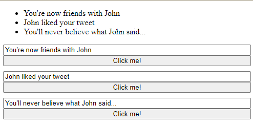
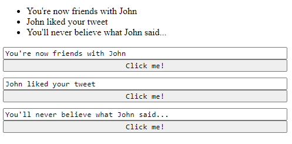
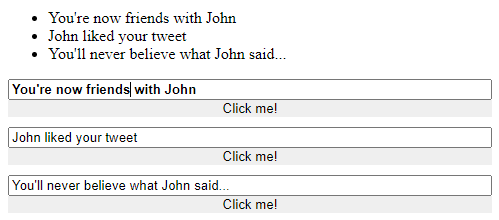

# Write CSS Inside of Angular 2 Components

**[📹 Video](https://egghead.io/lessons/angular-write-css-inside-of-angular-2-components)**

## Understanding Angular Styling ⚡
Let's take a look at our `Simple-Form Component` at **src/app/simple-form/simple-form.component.ts**

### simple-form.component.ts
```js
import { Component, OnInit, Input, Output, EventEmitter} from '@angular/core';

@Component({
  selector: 'app-simple-form',
  template: `<div>
  <input #myInput type="text" [(ngModel)]="message"/>
  <button (click)="update.emit({text:message})">Click me!</button>
  </div>`,
  styles: [
  ]
})
export class SimpleFormComponent implements OnInit {

  @Input() message

  @Output() update = new EventEmitter();

  constructor() {}

  ngOnInit(): void {
  }
```
Our template contains an `input` element and a `button` element nested within a `div` element. In the DOM, the `div` element is wrapped by our `app-simple-form` element, so the `app-simple-form` element is the outer element of the `Simple-Form Component` itself.

Therefore, we can remove the `div` element from our template entirely since the contents of our component are already wrapped by `app-simple-form`

### simple-form.component.ts
```js
...
@Component({
  selector: 'app-simple-form',
  template: `
  <input #myInput type="text" [(ngModel)]="message"/>
  <button (click)="update.emit({text:message})">Click me!</button>
  `,
  styles: [
  ]
})

...
```

Let's return to **src/app/app.component.ts**. Here, we're going to create a `styles` array and define some styles for our `app-simple-form` element.

### app.component.ts
```js
...
@Component({
  selector: 'app-root',
  template: 
  `<div>
    <ul>
      <li *ngFor="let message of mail.messages">{{ message.text }}</li>
    </ul>
      <app-simple-form 
      *ngFor="let message of mail.messages"
      [message]="message.text"
      (update)="onUpdate(message.id, $event.text)"
      >

      </app-simple-form>
  </div>`,
  styles: [`
    app-simple-form{
      margin-bottom: 10px;
    }
  `]
})

...
```

If we save our changes and start our development server,
```bash
ng serve
```
We can navigate to localhost:4200 in the browser and see that... nothing changed.

Before we can see our changes in effect, we need to define a `display` for our `Simple-Form Component` within the component itself. Here we'll add `display: flex` and `flex-direction: column` styles to our component.

### simple-form.component.ts
```js
...
@Component({
  selector: 'app-simple-form',
  template: `
  <input #myInput type="text" [(ngModel)]="message"/>
  <button (click)="update.emit({text:message})">Click me!</button>
  `,
  styles: [`
  :host {
    display: flex;
    flex-direction: column;
  }
  `]
})
...
```
Above, we use `:host` to reference the component itself, which in the DOM is represented by the `app-simple-form` element.

Returning to localhost:4200, we should now see our `margin-bottom`,`display:flex`, and `flex-direction:column` styles in effect.



If we try to define styles for everything with `*`, we'll see that **the styles we define within our component will be isolated to that component**:

### simple-form.component.ts

```js
...
@Component({
  selector: 'app-simple-form',
  template: `
  <input #myInput type="text" [(ngModel)]="message"/>
  <button (click)="update.emit({text:message})">Click me!</button>
  `,
  styles: [`
  :host{
    display: flex;
    flex-direction: column;
  }
  
  *{
    font-family: monospace;
  }
  `]
})

...
```



We can see above that only our `Simple-Form Component` elements have a `font-family` of `monospace`.

If we define styles for `input:focus` and `button` within our `Simple-Form Component`, we can now be confident that the styles will only affect those elements within that component.

### simple-form.component.ts

```js
...
@Component({
  selector: 'app-simple-form',
  template: `
  <input #myInput type="text" [(ngModel)]="message"/>
  <button (click)="update.emit({text:message})">Click me!</button>
  `,
  styles: [`
  :host{
    display: flex;
    flex-direction: column;
  }
  
  input:focus{
    font-weight: bold;
    outline: none;
  }
  
  button{
    border:none;
  }
  `]
})

...
```



## Resources 📖
- [Angular - Component Styles](https://angular.io/guide/component-styles)